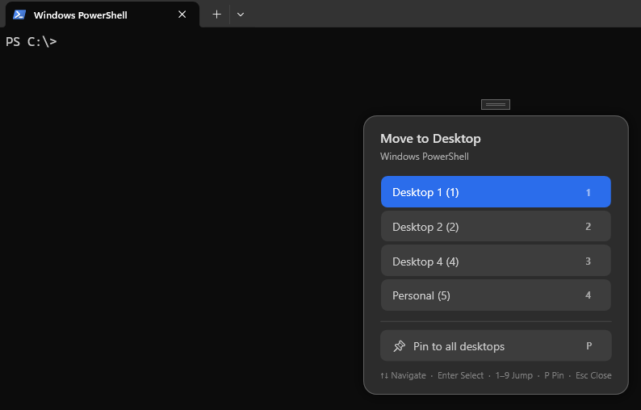

[](https://github.com/woanware/VirtualDesktopUtils/actions/workflows/dotnet.yml)

# VirtualDesktopUtils

VirtualDesktopUtils is a Windows 11 WPF utility for moving windows between virtual desktops via a hotkey-triggered picker popup and direct hotkeys. Pure WPF — no Windows Forms dependency.

## ✨ Highlights
- **Desktop picker popup** — press a configurable hotkey (default `Ctrl+Alt+Space`) to open a centered popup for the focused window. Pick a desktop by clicking, arrow keys + Enter, number keys 1–9, or press P to pin/unpin to all desktops. Auto-closes after selection or on Escape.
- **Direct move hotkeys** — configurable modifier (default `Ctrl+Alt`) + number 1–9 moves the focused window directly to that desktop without opening the picker.
- **Pin/unpin windows** — pin a window to all desktops or unpin it, via the picker popup.
- **Start with Windows** — optional startup toggle in settings.
- **App update checks** — optional startup and manual checks against GitHub Releases.
- Native Windows 11 virtual desktop integration via internal COM interop.
- Cross-process window move support (including modern/packaged apps like Windows Terminal).
- System tray icon with modern rounded dark context menu (Show, Refresh, Exit).
- Optional startup sync of COM GUID config from `MScholtes/VirtualDesktop11-24H2.cs`.
- Runs elevated (`requireAdministrator`) for reliability with elevated target apps.

## 🖼️ Popup screenshot


## 🧭 Typical workflow
1. Start VirtualDesktopUtils — it runs elevated and sits in the tray.
2. Press **picker hotkey** (default `Ctrl+Alt+Space`) while any app is focused to open the desktop picker.
3. Pick a desktop to move the window there, press a number key for instant move, or press P to pin to all desktops.
4. Alternatively, press **direct move hotkey** (default `Ctrl+Alt+1` through `Ctrl+Alt+9`) to move without opening the picker.

## 📚 Feature overview

### Desktop picker popup
- Triggered by a configurable global hotkey (capture any modifier+key combo in settings).
- Shows the target window name, available desktops (excluding the current one), and a pin/unpin option.
- Full keyboard navigation: ↑↓ arrows, Tab, Enter to confirm, 1–9 for instant move, P to pin/unpin, Escape to dismiss.
- Dark glass UI with rounded corners, drop shadow, and keyboard hints.

### Direct move hotkeys
- Configurable modifier (capture any modifier combo in settings) + number 1–9.
- Moves the focused window directly to desktop N without opening any UI.

### Settings UI
- Toggle auto-refresh desktop state on/off with configurable interval.
- Toggle start automatically with Windows.
- Toggle automatic app-update checks on startup.
- Manual **Check now** for app updates.
- Toggle GUID auto-update on startup + manual **Update now**.
- Press-to-capture hotkey fields for picker hotkey and direct move modifier.

### Tray behavior
- Minimize-to-tray on close.
- Modern rounded dark context menu: Show, Refresh, Exit.
- Double-click tray icon to show settings.

## 🧱 Architecture (high level)
- `src/WindowMain.xaml(.cs)`: settings UI, hotkey registration.
- `src/WindowPopUp.xaml(.cs)`: hotkey-triggered desktop picker popup.
- `src/WindowTrayMenu.xaml(.cs)`: rounded dark WPF tray context menu.
- `src/App.xaml.cs`: app startup/shutdown and tray lifecycle.
- `src/Services/GlobalHotkeyService.cs`: `RegisterHotKey`-based picker and direct move hotkeys.
- `src/Services/VirtualDesktopService.cs`: desktop enumeration, move, switch, pin/unpin via internal COM.
- `src/Services/WindowDiscoveryService.cs`: candidate top-level window filtering.
- `src/Services/RuntimeConfigService.cs`: persisted config (`config.json`) for all settings.
- `src/Services/AppUpdateService.cs`: app update check against GitHub Releases and version comparison.
- `src/Services/TrayIconService.cs`: system tray icon via Win32 `Shell_NotifyIcon` P/Invoke (no WinForms).

## 🚀 Getting started

### Prerequisites
- Windows 11
- .NET 10 SDK

### Build
```powershell
dotnet restore .\src\VirtualDesktopUtils.csproj
dotnet build .\src\VirtualDesktopUtils.csproj -c Release
```

### Run
```powershell
dotnet run --project .\src\VirtualDesktopUtils.csproj -c Release
```

Or run the built executable:
```powershell
.\src\bin\Release\net10.0-windows10.0.19041.0\VirtualDesktopUtils.exe
```

## ⚙️ Configuration notes
- Elevation is controlled by `src/app.manifest` (`requireAdministrator`).
- All settings are persisted to `%LOCALAPPDATA%\VirtualDesktopUtils\config.json`.

## 🙏 Sources and credits
- MScholtes VirtualDesktop (core move/interop patterns and internal COM references):  
  https://github.com/MScholtes/VirtualDesktop
- MaximizeToVirtualDesktop (virtual desktop move reference):  
  https://github.com/shanselman/MaximizeToVirtualDesktop
- Grabacr07 VirtualDesktop (additional API/reference context):  
  https://github.com/Grabacr07/VirtualDesktop
